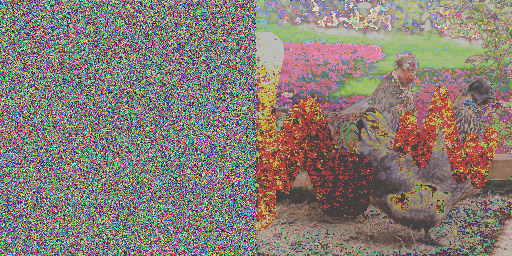

# Regularization by denoising diffusion process (RED-diff)

This is the README file for the implementaiton of variaitonal smapling in the paper https://arxiv.org/abs/2305.04391. It provides an overview of the project, instructions for installation and usage, and other relevant information.


## Description

This codebase implements a variational posterior sampling method termed RED-diff. It is orginated from varaitional inference by minimizing the KL divergence between the data distribution p(x) and a variational approximaiton q(x). We show that this leads to score matching regulrization, and assuming dirac distribution for q(x), it yields very simple updates that resemble regulrization by denoising diffusion process. 

This codebase includes experiments for various linear and nonlinear scenarios such as image inpainting, superresolution, Gaussian deblurring, motion debluring, high dynamic range (HDR), phase retreival, and nonlinear deblurring. We use Palette dataset for evaluation. The animation shows forward noising process ({$x_t$}) [left] and backward denoising prpcess ({$\mu_t$}) [right] based on RED-diff optimization. 




## Installation

1. Clone the repository: 

```
cd <root>
git clone https://gitlab-master.nvidia.com/mmardani/red-diff.git .
```

2. Download pretrained checkpoints: checkpoints available at _exp/ckpt 

<!-- ```
##unconditional guided diffusion for ImageNet
imagenet/256x256_diffusion_uncond.pt     
##class conditional guided diffusion for ImageNet
imagenet/256x256_diffusion.pt
imagenet/256x256_classifier.pt 
##guided diffusion with ffhq data   
ffhq/ffhq_10m.pt    
``` -->


| Description                                         | File                                      |
|-----------------------------------------------------|-------------------------------------------|
| Unconditional guided diffusion for ImageNet         | imagenet/256x256_diffusion_uncond.pt      |
| Class conditional guided diffusion for ImageNet     | imagenet/256x256_diffusion.pt             |
| Classifier for ImageNet (256x256)                   | imagenet/256x256_classifier.pt            |
| Guided diffusion with FFHQ data                     | ffhq/ffhq_10m.pt                          |


3. Install the dependencies: 

```
pip install -r requirements.txt
```

4. Add external dependencies: we use external codes for motion-blurring and non-linear deblurring. 

```
git clone https://github.com/VinAIResearch/blur-kernel-space-exploring bkse
git clone https://github.com/LeviBorodenko/motionblur motionblur
```


## Usage

1. Choose the degradation. The degradation.py covers several linear and nolinear tasks

```
deg=in2_20ff     #[sr4, deblur, deblur_gauss, deblur_uni, phase_retrieval, deblur_nl, hdr]
```

2. Choose the algorithm.

```
algo=reddiff     #[ddrm, pgdm, reddiff, dps, mcg]
```

3. Tune the hyperparamaters interactively using sampling script: 


```
sh sample_test.sh 
```

An instance of sampling script is as fllows

```
samples_root=<root>/_exp
model.ckpt=imagenet256_uncond   
#-cn imagenet256_cond      #for conditional imagenent ckpt with classifier guidance
algo=reddiff    
deg=in2_20ff   
num_steps=100    #number of diffusion steps
sigma_y=0.0      #measurement noise std
batch_size=10
lambda=0.25
lr=0.5

python   main.py  algo=$algo    algo.deg=$deg    exp.num_steps=$num_steps    algo.sigma_y=$sigma_y    loader.batch_size=$batch_size   loader=imagenet256_ddrmpp    dist.num_processes_per_node=1   exp.name=debug  exp.save_ori=True   exp.smoke_test=1  exp.samples_root=$samples_root   exp.save_evolution=True   algo.lr=$lr    algo.grad_term_weight=$lambda
```

4. For more data run the batch job 

```
sh sample_batch.sh   #for batch jobs 
```


5. Run the evaluation script: 

```
sh run_eval.sh
```


## Citation
If you find our work interesting, please consider citing

```
@article{mardani2023variational,
  title={A Variational Perspective on Solving Inverse Problems with Diffusion Models},
  author={Mardani, Morteza and Song, Jiaming and Kautz, Jan and Vahdat, Arash},
  journal={arXiv preprint arXiv:2305.04391},
  year={2023}
}
```

```
@inproceedings{song2023pseudoinverse,
  title={Pseudoinverse-guided diffusion models for inverse problems},
  author={Song, Jiaming and Vahdat, Arash and Mardani, Morteza and Kautz, Jan},
  booktitle={International Conference on Learning Representations},
  year={2023}
}
```

## License

This project is licensed under the [NVIDIA Source Code License](LICENSE).

## Contact

For any inquiries, please contact [mmardani@nvidia.com](mailto:mmardani@nvidia.com).

<!-- ## Acknowledgement

We want to thank Jiaming Song for his contributions to the codebase.  -->


